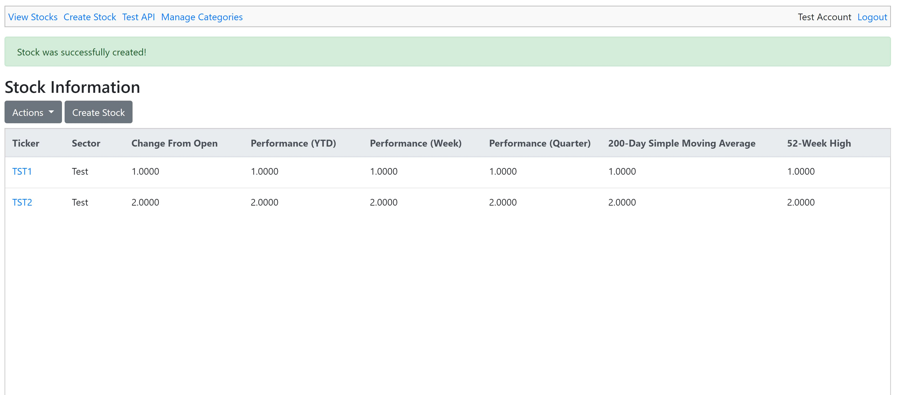

# Artifact 1: Software design and engineering

For my first enhancement I choose to improve upon the final project I completed in the class CS-340.  In this class I created a program that allowed the user to keep track of and display stock information for restful API.  This program was written in python and used bottle as its web framework and Mongo as its database.  I choose this program because I am confident am by web development skills and because I noticed several glaring flaws in this programs design.  The first was its lack of a UI for the user to browse and make changes without having to write out a rest call.  The second is that none of the rest calls do any validation on the users input to ensure any kind of structure.  It does not check to see if the json object that is passed as any of the required fields and simple throws the object into the mongo database.  To showcase by skills in software design and engineering I intend to rectify this issue.

To start fixing this issue I decided to rework the entire program from the ground up using Pyramid as the web framework and Postgres and my database.  I choose Postgres instead of Mongo because it allows me to more easily enforce a database structure and for this kind of project that has a set number of fields the flexibility of Mongo doesn’t gain us anything.  Also, by rewritten this software using a different framework I was able to showcase my skills transferring a piece of software to a new framework.

Next I used the Jinja2 templating language and create a few simple web pages that allowed me to create, read update and delete stocks through a web browser.  Each page had a corresponding view that handled the backend logic for the page.  The entire project adheres to a model view controller schema.  By building a GUI to go along side the rest calls from the original project I showcased my skills at improving a piece of software and expanding a project complexity.  Finally, I recreated the rest calls from the pervious project in the new project.  These calls work the same as they did in the previous piece of software, but the biggest change is that they now validate the fields before inserting them into the database.  If the validation fails a json object containing the error is returned to the user.  This will help prevent invalid entries from being added to the database.

The biggest challenge that I faced why improving this software was finding an efficient way to validate a form that had a lot of fields. A ton of ifs statements quickly becomes unwieldy.   I eventually decided on creating a series of helper classes called Form and Field.  The Field class stores callback functions for validating a single form field.  It receives the fields value and raises a validation exception if validation fails.  The form class is a collection of many of these fields.  It takes the form data and returns a new dictionary object of the cleaned data if it all passes validation.  If it fails a new form is created with the original data, the invalid data and the exceptions attached to it that can be used to render the error back to the user.  The convenient thing about this classes is that they could also be used for validating the restful API calls with very little changes. The only thing that needed to be added was a method to convert a validation exception into a json serializable object.

Going forward I would like to add a way to authenticate these requests.  In the real world an API wouldn’t just allow anyone who happens to know the URL to make changes.  They would require user authentication.  Before by final project I would like to add that.

- [Self Assessment](index.md)
- [Artifact 2](artifact2.md)
- [Artifact 3](artifact3.md)
