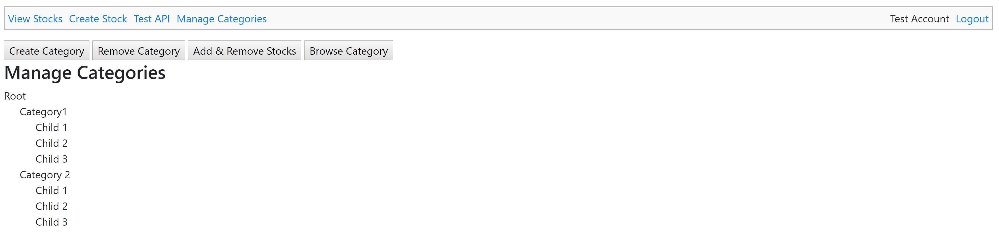
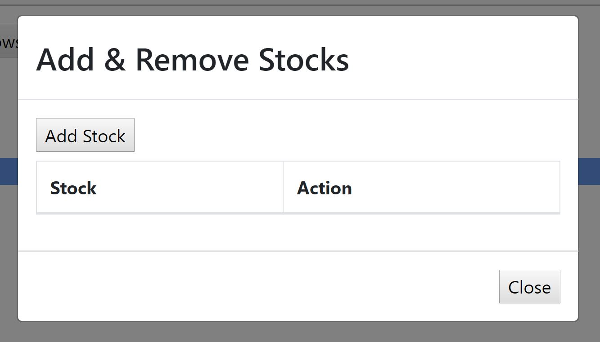
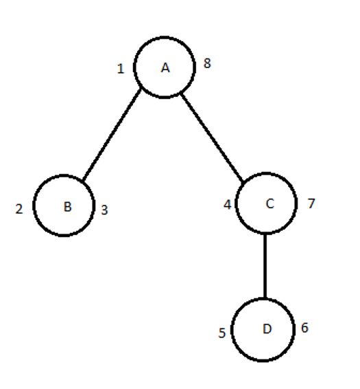

## Artifact 2: Algorithms and data structure




For the category of Algorithms and Data Structures I choose to continue updating the artifact from CS-340.  This artifact started out as a simple program that allowed the user to keep track of stock information via restful API calls.  I updated in the previous category to have a web interface and to use Pyramid and Postgres instead of Bottle and Mongo.  In this update I added a method to categorize stocks.  In the UI a user can create a new category and can add one or more stocks to the category.  Categories can be nested.  For example, the user might have a social media category inside of the tech category.

I selected this artifact for several reasons.  The first is that I could continue building upon the first project to create an even more impressive final artifact.  The second is because this data structure is also saved to a database, so it builds upon the objectives that need to be shown in the next artifact, databases.  The third is because it gives me the opportunity to build an efficient algorithm for storing nested sets in a relational database.

The biggest issues with storing category information in a relational database are retrieving them efficiently.  Let’s say for example you wanted to retrieve all items in category 1 and all its subcategories.  Items have a foreign key to an association table that links items to one or more categories.  You can easily use a join to retrieve all items in the top-level category, but you run into trouble retrieving items in the subcategories.  You need a recursive lookup, but most relational databases don’t have this functionality.  So, what are your options?  You could recursively make a database request for every category and then look up the items in each category separately.  This method works but it is very inefficient.  What we need is a way to perform this kind of lookup in a single request so how can we do that?  Enter the nested set model algorithm and data structure.  This algorithm adds a left and a right column to our category table and categories are assigned incrementing values to these columns.  To assign values to the left and right columns start with the root node and follow the following pseudocode recursively.

```
Function assign_left_and_right_values(node, index=1):
	If node has no children:
		Node.left = index
		Node.right = index + 1
		Index += 2
	Else if node has children:
		Node.left = index
		Index += 1
		For each child in children:
			Index = Assign_left_and_right_values(child, index)
		Node.right = index
		Index += 1
	Return Index
```

If you follow this algorithm correctly you should end up with a database structure that looks like this.



Now if you want to retrieve all items inside category A you can just join items by their category and check to see if left >= 1 and right <= 8.  This allows you to perform lookup in a single request and is much more efficient.

This pattern looks great for lookups, but its biggest challenge was ensuring that the left and right values remain correct.  Whenever you delete or insert into the database now you must remember to shift the left and the right values of every node accordingly.  To handle this, I created several helper methods on my category model that do just that.  All inserts and deletes in the category table go though these methods and they ensure correctness.

- [Self Assessment](index.md)
- [Artifact 1](artifact1.md)
- [Artifact 3](artifact3.md)